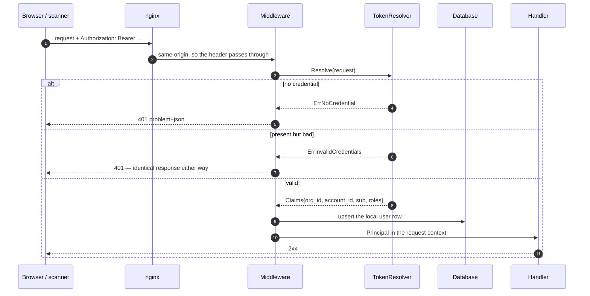
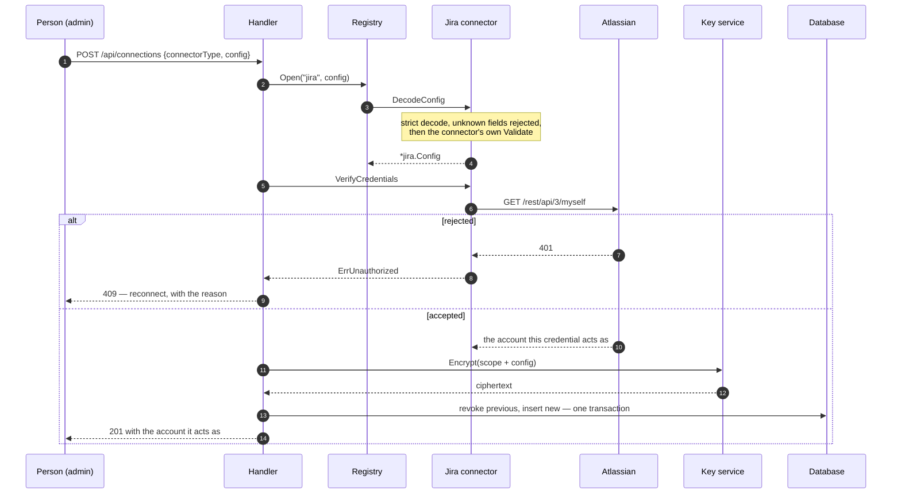
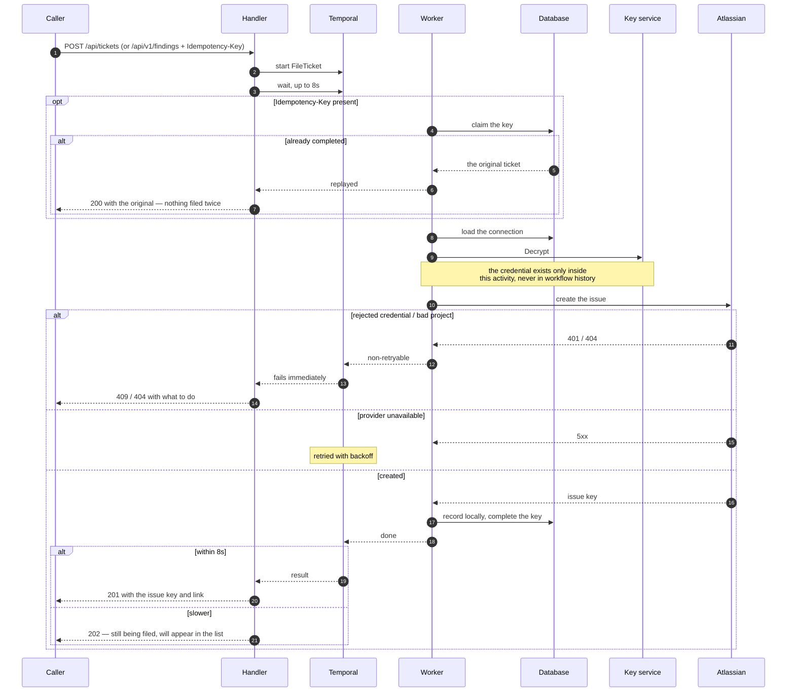
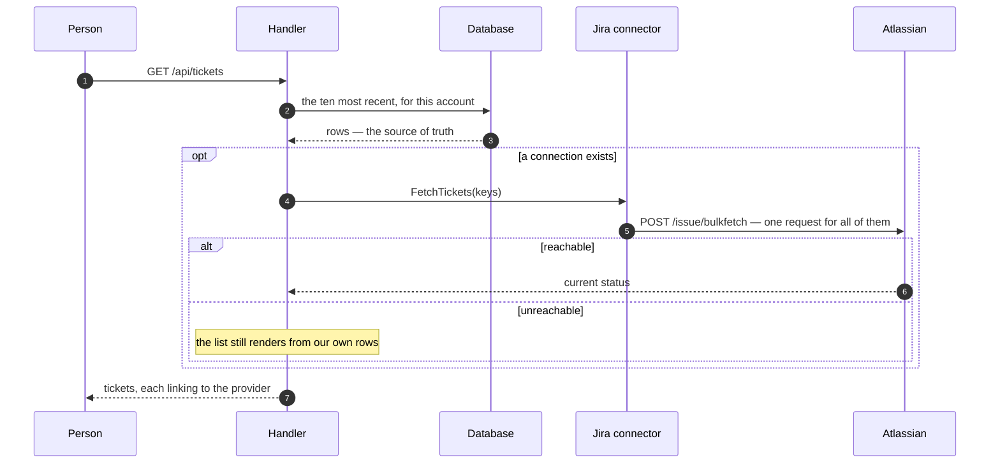
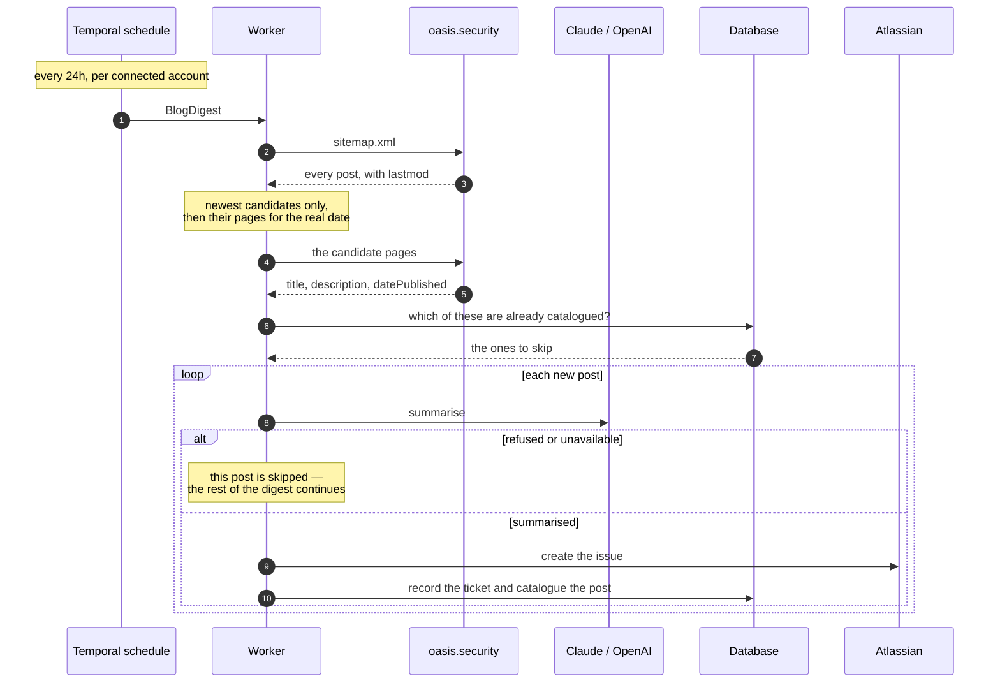
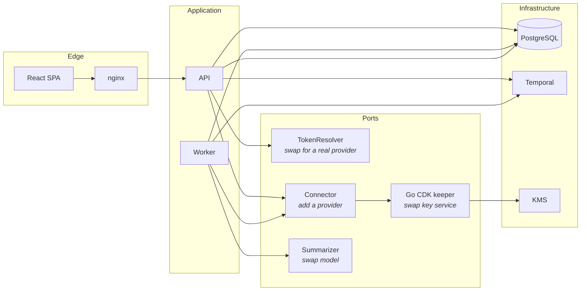

# Flows

The five paths through IdentityHub, each with the reasoning behind its shape.

Read these alongside [DECISIONS.md](DECISIONS.md), which covers the choices;
this file covers the sequences.

---

## 1. A request arrives

Every other flow starts here. It is short on purpose: a request carries a
signed token, and everything the application needs to know about the caller is
inside it.

**The tenancy comes from the token.** `org_id` and `account_id` are claims the
identity provider put there when it issued the token. Nothing downstream reads
them from a body, a header or a query parameter — the request types have no such
field, so an attempt is rejected as an unknown field rather than ignored.

**A missing credential and a bad one look the same.** Both are `401` with the
same body. Distinguishing them would let a caller probe which tokens exist.

**The user row is a projection, not a source of truth.** It is refreshed from the
token on every request so an audit event can say "Dana Admin" instead of a
subject identifier. Nothing is authorised from it, and a failure to write it is
logged rather than failing the request.

**Roles come from the token.** `requireAdmin` reads the claim. This application
never grants, stores or revokes a role — the provider does.

---

## 2. Connecting an integration

**Verification happens before the write.** Storing a credential that has never
worked leaves an account broken in a way that only shows up when someone tries
to file a ticket.

**The credential is encrypted before it is stored, and never read back out.**
Non-secret fields — site URL, account email — go in a separate `metadata`
column, so listing connections needs no decryption and no key service call.

**The tenancy is sealed inside the ciphertext.** A row copied to another account
fails to decrypt rather than quietly working.

**Revoke-then-insert is one transaction.** Reconnecting is the remedy for a
rejected credential, so it must not be able to leave an account with two active
connections or none.

**Connecting starts the digest schedule** — see flow 5.

---

## 3. Filing a finding

The one that earns durable execution.

**Durable, but not asynchronous.** The brief wants a clickable link, and
"queued" is a worse product than "created NHI-123". So the request waits briefly
and returns `201` in the common case; only a genuinely slow provider produces
`202`, and the workflow keeps going either way.

**The credential never enters workflow history.** Temporal persists workflow
arguments and activity results in its own datastore. The workflow carries a
tenancy and a connector type; decryption happens inside the activity, and the
plaintext crosses no activity boundary in either direction.

**Retries are classified, not blanket.** A rejected credential or a missing
project fails the same way every time — retrying it only delays the error the
user needs. An outage or a rate limit is retried with backoff. The connector
error taxonomy is what makes that distinction available.

**Recording locally is a separate step because it is the point.** A crash
between "created in Jira" and "recorded here" would leave a ticket the recent
tickets view never shows. That is the whole reason this is a workflow.

**A retry that finds the ticket already recorded converges.** It completes the
idempotency key and returns the existing row rather than failing — and a claim
abandoned by a dead worker is taken over after fifteen minutes, so a crash
cannot lock a key forever.

---

## 4. Recent tickets

**Our own table answers "created from this app".** A label in Jira is mutable by
anyone with access and can be added to issues we did not create, so it cannot be
trusted for this. We do apply one for traceability; we just do not read it back.

**One request, not one per row.** `bulkfetch` resolves every key at once, and
takes no JQL — cheaper, and no injection surface.

**Live status is a nicety.** If the provider is unreachable the list still
renders from local rows, because a status column is not worth failing a page
over.

---

## 5. The blog digest

**A schedule, not a cron loop.** Temporal owns it, so it survives restarts and
needs no reconciliation at boot. It is created when an account connects an
integration and deleted when it disconnects — a digest with no credential has
nothing to run with.

**The site publishes no feed**, and its blog index is alphabetical, so "most
recent" cannot be read from the listing. `sitemap.xml` carries `lastmod` for
every post, which selects candidates in one request; the authoritative date
comes from `datePublished` on the page itself, because an edit to an old post
would otherwise float it to the top.

**Deduplication is a unique index**, on `(org_id, account_id, post_url)`. The
catalogue check is an optimisation; the constraint is the guarantee, so a
replayed or concurrent run is rejected by the database rather than by
application ordering.

**One bad post does not stop the digest.** Each is filed independently, and a
failure is recorded and skipped.

**No model key is required.** Without one the digest uses an offline summarizer
that says so in the ticket. The digest is a bonus feature and must not be the
reason the stack fails to start.

---

## Where the seams are

Four seams, each one implementation deep today:

| Port | Today | To change it |
|---|---|---|
| `TokenResolver` | development stand-in | verify signatures against the provider's JWKS |
| `Connector` | Jira | add an implementation, register it |
| Go CDK keeper | AWS KMS via floci | change `SECRETS_KEEPER_URL` |
| `Summarizer` | Claude, OpenAI, offline | change `SUMMARIZER_PROVIDER` |

Two of the four are configuration. The other two are one file each.
